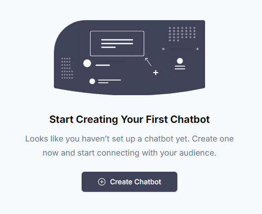
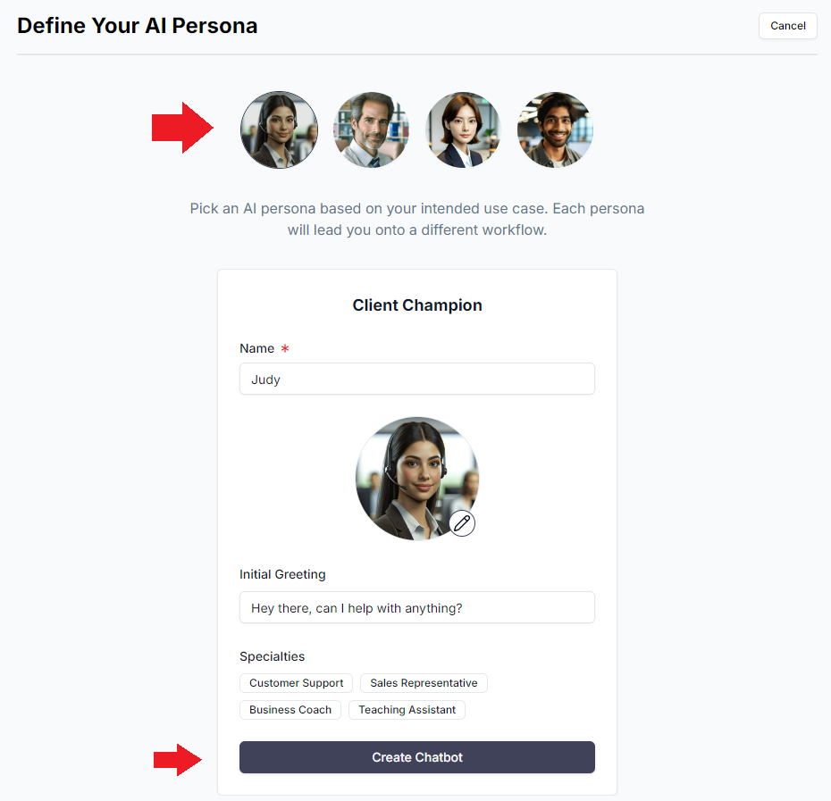
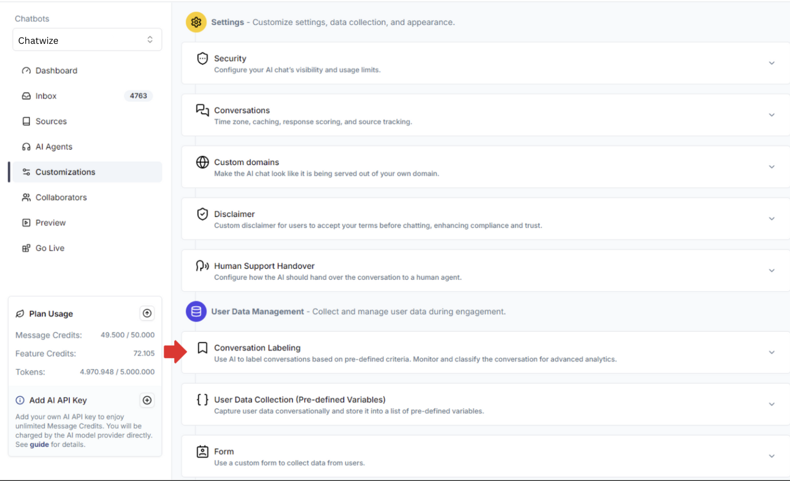
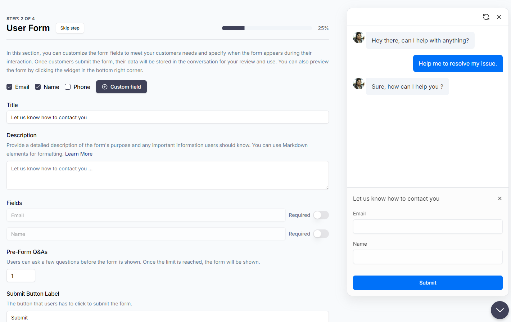

Om te beginnen, log eerst in op je account. Als dit de eerste keer is dat je Chatwize gebruikt, moet je enkele initiële onboarding-stappen doorlopen. Daarna krijg je de mogelijkheid om een AI-chatbot te bouwen op basis van een van onze sjablonen:

## Initiële Setup

Klik op "Create Chatbot". Vervolgens krijg je enkele persona’s te zien om je AI-agent te karakteriseren op basis van je gebruikssituatie.

Deze persona’s zijn vooraf ingesteld met specifieke aanpassingen voor verschillende toepassingen, zodat ze direct kunnen worden gebruikt. Elke persona heeft een andere setup-flow, maar ze zijn allemaal eenvoudig te volgen.

Laten we als voorbeeld de **Client Champion** nemen. Nadat je deze persona hebt geselecteerd, kies je de specialisatie van je AI-agent. In dit geval kiezen we **Customer Support**. Vervolgens geef je op welke organisatie de AI-agent vertegenwoordigt en wie de contactpersoon is voor escalaties.

Afhankelijk van hoe strikt je wilt dat de AI-agent zich aan de trainingsdata houdt (die je later toevoegt), kun je een van de opties onderaan kiezen. Laten we voorlopig **"Rely only on given data"** selecteren voor een conservatieve aanpak.

Klik op **"Continue"**. Omdat dit een klantgerichte chatbot is, word je gevraagd een gegevensverzamelingsformulier in te stellen voor de gebruiker.

Hier kun je aangepaste formuliervelden definiëren, bepaalde velden verplicht maken, het formulier verplicht stellen na een bepaald aantal vragen en antwoorden, en nog veel meer. Zodra de gebruiker het formulier indient, worden de gegevens verzameld en gekoppeld aan de conversatiesessie. Je kunt deze gegevens exporteren als een CSV-bestand of automatisch laten verzenden per e-mail of naar een CRM via een webhook.

Als je geen formulier wilt, klik dan op **"Skip step"** bovenaan links naast de titel.

Vervolgens kun je het uiterlijk van de chatwidget aanpassen. Om het consistent te maken met de rest van je website, bieden we een breed scala aan aanpassingsopties, zoals lettergrootte, kleuren, avatars en meer. We houden het eenvoudig voor deze gids, maar je kunt later meer geavanceerde instellingen aanpassen onder het tabblad **Customizations** in de linker navigatiebalk.

## Trainingsgegevens Uploaden

Nu ben je klaar om je AI-agent te trainen met je eigen data! 

Je kunt relevante trainingsgegevens uploaden (PDF's, Word-documenten, TXT-bestanden) of vraag-en-antwoord-paren toevoegen na het maken van de chatbot. Als je Excel-tabellen, CSV's, afbeeldingen of YouTube-video’s hebt, kun je deze later uploaden onder het tabblad **Sources** in de linker navigatiebalk.

Klik op **"Add to Sources"**.

Wacht tot de training is voltooid. Klik vervolgens op **"Try it out"**. Chatwize opent een nieuw tabblad waar je de chatbot kunt testen.

Over het algemeen zou de chatbot direct goed moeten werken voor de meeste toepassingen. Wil je echter het gedrag verder verfijnen, de trainingsgegevens of het uiterlijk bijwerken, of extra AI-agents toevoegen om de chatbot uit te breiden? Dat kan allemaal door de chatbot te openen en diverse instellingen in de linker navigatiebalk aan te passen.

Sluit het testtabblad en keer terug naar de hoofdinterface van Chatwize. Volg de onboarding-gids om meer te leren over de beschikbare opties.

Wanneer je klaar bent om je chatbot te implementeren, ga naar het tabblad **Go Live**.

Als je de chatbot als een zelfstandige pagina wilt delen, klik dan op **"Link"**. Je krijgt automatisch een deelbare link.

Wil je de chatbot inbedden op een webpagina? Klik dan op **"Website"**. Gedetailleerde instructies verschijnen aan de rechterkant van het scherm.

Om meer chatbots toe te voegen, ga naar de linker zijbalk en klik op het dropdown-menu. Dit brengt je naar een speciale pagina waar je al je chatbots kunt beheren.

Houd er rekening mee dat afhankelijk van je abonnement er een limiet is aan het aantal chatbots dat je kunt maken.

## Onderbroken Werkstromen

Als je je browser op enig moment moet afsluiten en later wilt terugkeren naar het maken van je chatbot, krijg je een scherm zoals hieronder te zien. Je kunt eenvoudig doorgaan met de chatbot door op de **Work-In-Progress (WIP)** chatbotkaart te klikken.

