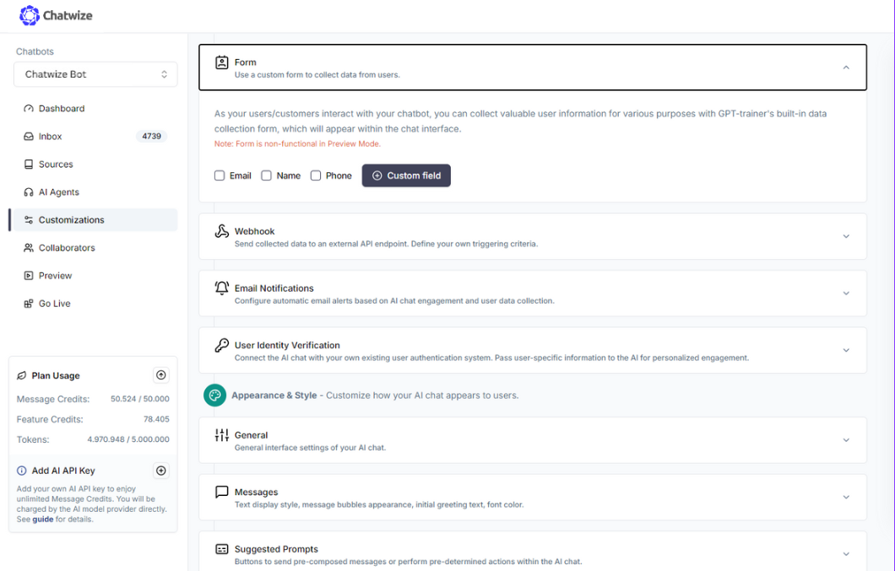
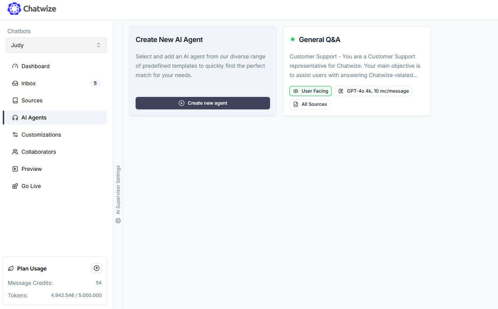
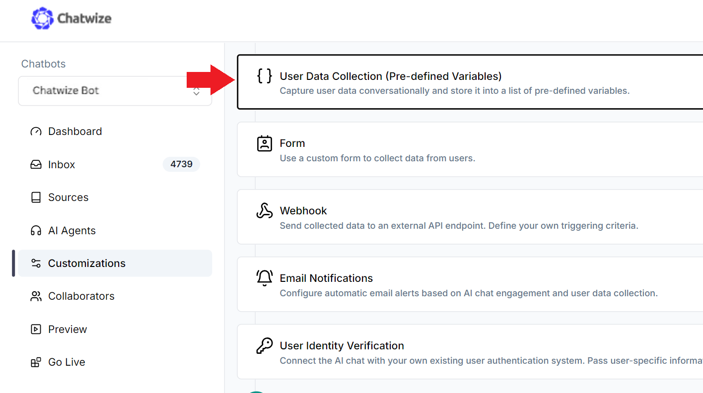

Er zijn twee manieren om gegevens van gebruikers te verzamelen wanneer zij met jouw AI Chat in interactie treden.

1. Via een formulier  
2. Conversatiegewijs

Er zijn voor- en nadelen aan elke aanpak. Formulieren zijn eenvoudiger op te zetten en zijn programmeerbaar, maar het verzamelen van informatie via een conversatie is natuurlijker en boeiender, ondanks de extra complexiteit. Je kunt alle verzamelde gegevens via webhook naar een CRM sturen zodra jouw gebruiker deze indient.

---

### Gegevens verzamelen via een formulier

Om een formulier toe te voegen aan jouw AI Chat, ga naar de **Customizations** tab in het linker navigatiemenu, en scroll naar beneden totdat je de “Form” sectie ziet:



Je kunt een van de standaardvelden selecteren die je in het formulier wilt opnemen. Als alternatief kun je aangepaste velden maken.


Voor aangepaste velden kun je de veldtypes wijzigen (text, dropdown, checkbox). Je kunt bepaalde velden ook verplicht maken. Als minstens één veld verplicht is, krijg je tevens de optie om het gehele formulier verplicht te maken voordat de gebruiker verder kan chatten. Het verplicht maken van het formulier zorgt ervoor dat de “x” knop rechtsboven in het formulier verdwijnt, waardoor gebruikers het formulier niet kunnen sluiten voordat het volledig is ingevuld.


---

### Gegevens verzamelen via conversatie

Als je een natuurlijke conversatiestroom wilt behouden en direct gegevens van gebruikers wilt verzamelen, moet je de prompt van je AI Agent(s) configureren en variabelen instellen om de verzamelde informatie op te slaan.

---

### De prompt bewerken

Het gedrag van jouw AI Chat wordt bepaald door de prompt van jouw AI Agent(s). Om de prompt te bekijken en te bewerken, ga naar de **AI Agents** tab in het linker navigatiemenu, en klik op de Agent die je wilt bewerken.

Als je jouw AI Chat hebt gemaakt met behulp van een template, maak je mogelijk gebruik van een standaard prompt die wij voor je hebben gegenereerd. Als dit de eerste keer is dat je een AI Agent prompt configureert, raden we je aan onze **Prompt Engineering guide** te lezen voor best practices.




Configureer je prompt zodat deze gedetailleerde instructies bevat voor het verzamelen van gebruikersgegevens. Zorg ervoor dat je aangeeft wanneer, wat en hoe. Bijvoorbeeld, hier is een snippet die als leidraad kan dienen:

---

### Instructies

```plaintext
- Wanneer je voor de eerste keer met de gebruiker in gesprek gaat, vraag dan op een beleefde manier om hun voornaam.
- Zodra de gebruiker hun voornaam heeft opgegeven, ga dan verder met de volgende stappen om hun contactgegevens te verzamelen.
- Vraag na het verzamelen van hun voornaam om het mobiele telefoonnummer van de gebruiker.
- Nadat het mobiele telefoonnummer is verzameld, vraag om hun e-mailadres.
- Als de gebruiker zich niet op zijn gemak voelt om een bepaald stuk informatie te verstrekken, dwing ze dit dan niet af. Respecteer hun beslissing.

Go to Customizations tab on right navigation bar, then scroll down until you see “User Data Collection”. Click to expand it.



Binnenin kun je variabelen aanmaken om de informatie op te slaan die tijdens het gesprek van de gebruiker wordt verzameld. Je kunt meerdere variabelen instellen, waarbij elke variabele overeenkomt met een enkel gegeven. Geef bij het instellen van een variabele de variabelenaam, beschrijving en voorbeeldwaarden op. Probeer zo gedetailleerd en expliciet mogelijk te zijn.


*Hoe meer voorbeelden je geeft, hoe beter de AI het gewenste formaat kan begrijpen.*